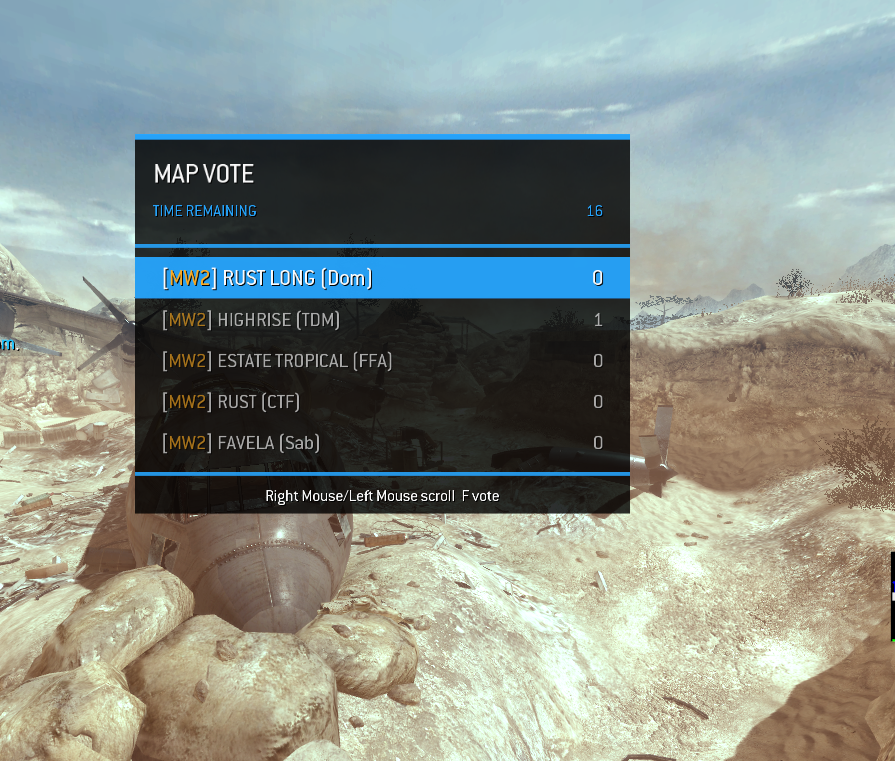

# CWS Server Toolbox Menu

Ready-to-install IW4x GSC administration menu with automatic IW4MAdmin role access.

## Requirements

- IW4x dedicated server
- IW4MAdmin 2026.3 or newer
- Moderator, Administrator, and Owner levels configured in IW4MAdmin
- Dragnet installed in IW4MAdmin only when using the Dragnet menus

## Install

1. Stop the IW4x server and IW4MAdmin.
2. Remove any legacy `_mapvote.gsc` installation, including `userraw/scripts/_mapvote.gsc`. Running both voting systems can create duplicate menus and script errors.
3. Remove loose files from an older CWS installation: `userraw/scripts/menu_loader.gsc` and the CWS `menu.gsc`, `menu_functions.gsc`, and `mapvote.gsc` files under either `userraw/maps/mp/gametype` or `userraw/maps/mp/gametypes`.
4. Copy `IW4MAdmin/Plugins/CWS.AdminMenu.IW4MAdmin.Plugin.dll` into the `Plugins` directory of your IW4MAdmin installation.
5. Copy `userraw/z_cws_admin.iwd` into every IW4x server's `userraw` directory.
6. Start IW4MAdmin.
7. Start the IW4x server or rotate/restart the current map.

The resulting server layout should contain:

```text
IW4MAdmin/
└── Plugins/
    └── CWS.AdminMenu.IW4MAdmin.Plugin.dll

userraw/
└── z_cws_admin.iwd
```

The IWD contains `scripts/menu_loader.gsc` and the `maps/mp/gametypes` menu scripts. Do not extract it.

## Access

The IW4MAdmin plugin automatically grants the appropriate menu when a Moderator, Administrator, or Owner joins. Access is scoped to the individual player and restored after map restarts and rotations.

The default open bind is shown in game. Personal binds and visual settings are persisted through GUID-scoped DVARs.

## Features

- Role-aware Moderator, Administrator, and Owner menus
- Player moderation, watching, team, movement, and utility controls
- IW4MAdmin history, warning, report, alias, and ban-information views
- Optional Dragnet peer, event, and action menus
- Dynamic installed-map discovery, including custom maps
- Server settings, presets, Bot Warfare controls, and map rotation tools
- Themed end-of-match map voting with live voters, configurable timer, and 2-15 choices
- Single-map/24-7 support that turns configured gametypes into voting choices
- Vote and changed-vote notifications for all connected human players
- Delayed restart, rotation, announcements, maintenance, and lockdown events
- Custom themes, colors, fonts, shaders, animations, opacity, position, and binds
- Review and confirmation screens for destructive operations

## Map Voting



Map Voting is enabled by default and opens for all human players at the end of a match. Options show the source game, map, gametype, current voters, and remaining time. Late joiners are attached while voting is active.

Existing configurations remain compatible through these DVARs:

- `mapvote_small_maps`, `mapvote_med_maps`, and `mapvote_big_maps`
- `mapvote_modes`
- `mapvote_map_timer`
- `mapvote_gamemode_timer` (retained for configuration compatibility)
- `mapvote_optionsCount` (2-15 choices)

If every configured entry resolves to one map, the map stays fixed and players vote between the configured gametypes. Missing DVARs receive safe defaults automatically.

## Automatic Updates

The IW4MAdmin plugin checks the repository's latest GitHub release every five minutes. When a newer release is available, it validates and installs the plugin DLL and `z_cws_admin.iwd` from the official release assets.

Managed IW4/IW4x server paths are refreshed every five seconds. Working directories, game-log paths, and manually configured log paths are considered, including layouts such as `/game/userraw/logs`. A candidate is accepted only when it is named `userraw`, contains no executable files itself, and its direct parent contains an IW4x executable. This rejects COD4x, IW4MAdmin, and unrelated game folders. The latest release's `z_cws_admin.iwd` is installed directly into every validated IW4 `userraw` folder. Existing DLL and IWD files are backed up before replacement. Legacy loose CWS scripts are also backed up and removed so they cannot override the updated IWD.

After an update, restart IW4MAdmin to load the new plugin and rotate or restart each IW4x server map to load the new IWD. Update checks and automatic installation can be changed in `CWSAdminMenuSettings.json`.

Administrators can view the current version, latest release, What's New, fixes, and restart status from **Admin > CWS Admin Menu** in Webfront. Its **Configuration** tab lists every resolved server `userraw` folder and the active updater settings.

When publishing a GitHub release, use a version tag such as `v0.20.0`. The included release workflow validates and attaches `CWS.AdminMenu.IW4MAdmin.Plugin.dll` and `z_cws_admin.iwd`; these are the assets consumed by the updater. Put user-facing changes under `## What's New` and corrections under `## Fixes` in the release notes so the Webfront tabs can separate them.

## Safety

The menu uses server-side GSC, IW4MAdmin events, DVARs, and RCON. It does not scan player computers, inject into clients, or read client memory.

## Version

`0.20.2`

## Third-Party Code

The map-vote endgame integration is adapted from
[jakelooker/IW4x-Map-Voting-System](https://github.com/jakelooker/IW4x-Map-Voting-System)
under GPL-3.0. See `THIRD_PARTY.md` and `LICENSES/`.
